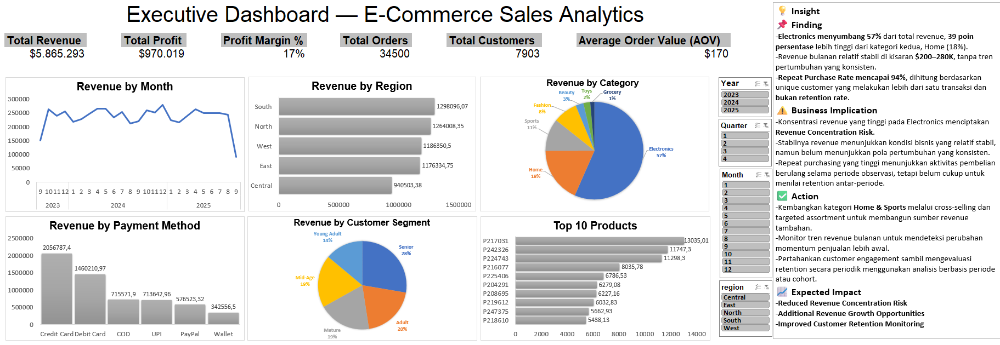
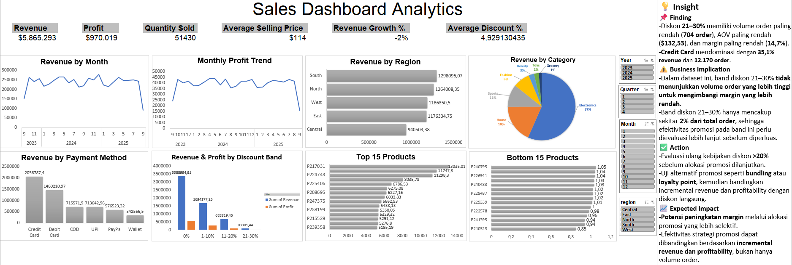
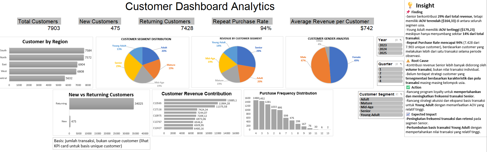
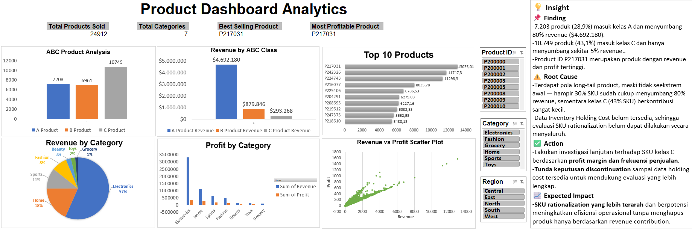
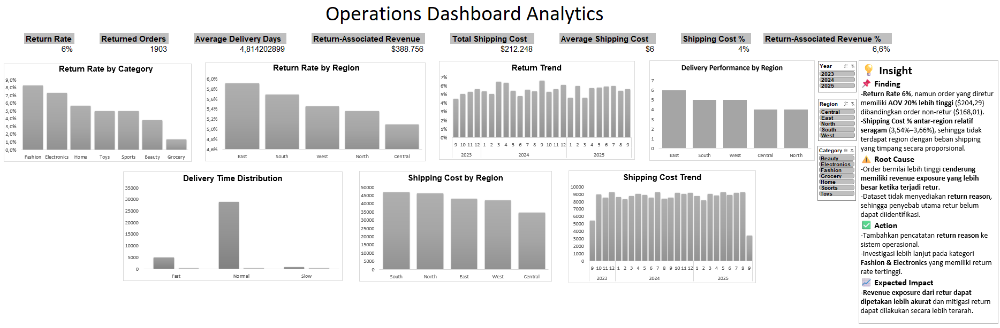
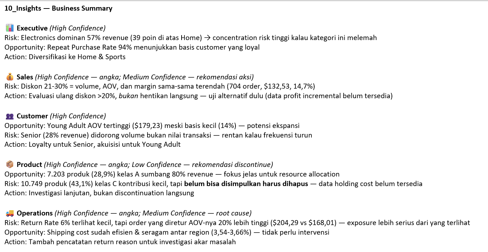

# 📊 E-Commerce Sales Analytics Dashboard

> End-to-end Excel analytics project — from raw transactional data to
> validated business insights. Built entirely in **Excel 2019** using
> Power Query (ETL), PivotTables, PivotCharts, and Slicers — no external
> BI tools.


---

## 🖼️ Dashboard Preview

| Executive | Sales |
|---|---|
|  |  |

| Customer | Product |
|---|---|
|  |  |

| Operations | Insights Summary |
|---|---|
|  |  |

---

## 📌 Key Metrics

| Metric | Value |
|---|---:|
| Total Revenue | $5,865,293 |
| Total Orders | 34,500 |
| Total Customers | 7,903 |
| Average Order Value (AOV) | $170 |
| Total Profit | $970,019 |
| Profit Margin | 17% |
| Repeat Purchase Rate | 94% |
| Return Rate | 6% |

---

## ❓ Business Questions

This project was built to answer:

1. What drives overall revenue performance?
2. Which customer segments contribute most to revenue — and are they the
   most *valuable*, not just the largest?
3. Is discounting associated with higher sales volume?
4. Which product category creates concentration risk?
5. What is the financial exposure from returned orders?
6. Are logistics (shipping) costs consistent across regions?
7. Which payment method has the most untapped growth potential?

---

## 🔍 Analytical Approach

- **Data Cleaning & Validation** — missing values, duplicates, format checks,
  locale correction
- **ETL via Power Query** — derived fields, Merge Queries, Date Intelligence
- **Descriptive & Trend Analysis**
- **Customer Segmentation** — age-based, New vs Returning
- **ABC Analysis / Pareto** — 80/20 product ranking
- **Discount × Profitability Analysis**
- **Return & Logistics Analysis** — normalized by revenue, not raw totals
- **Payment Method Analysis** — AOV-based, not just revenue ranking

Every finding follows a **Finding → Evidence → Business Impact →
Recommendation** structure, with explicit disclaimers where the dataset
cannot support a causal claim.

---

## 💡 Key Findings (Summary)

Full detail with evidence tables: [`docs/Insights_Final.md`](./docs/Insights_Final.md)

1. **Repeat Purchase Rate 94%** — high repeat purchasing behavior across
   the observed period, though not a true time-windowed retention metric.
2. **Electronics = 57% of revenue** — a 39-point gap over the next category
   (Home, 18%), indicating meaningful revenue concentration risk.
3. **Highest revenue segment ≠ highest value segment** — the Senior segment
   contributes the most revenue (28%) but has the *lowest* AOV among all
   age groups, driven by transaction volume rather than transaction value.
4. **Discounts above 20% show no volume benefit** — this band has the
   lowest order volume, lowest AOV, *and* lowest margin simultaneously.
5. **Return exposure is understated by Return Rate alone** — returned
   orders have a ~20% higher AOV than non-returned orders, meaning
   higher-value orders are disproportionately returned.
6. **Shipping cost is proportionally consistent across regions** (3.5%–3.7%
   of revenue) — the raw nominal comparison was misleading before
   normalizing by revenue.
7. **Wallet has a competitive AOV despite the lowest revenue share** —
   indicating potential for further adoption, subject to testing.
---

## ✅ Recommendations

**Short-Term**
- Re-evaluate the >20% discount policy before continuing this spend
- Pilot-test Wallet adoption incentives with measurable tracking
- Add a return-reason field to enable root-cause analysis going forward

**Medium-Term**
- Diversify category revenue (Home, Sports) to reduce Electronics dependency
- Design separate strategies for high-volume (Senior) vs high-value (Young
  Adult) customer segments
- Run SKU rationalization analysis pending additional cost data

---

## ⚠️ Limitations

- No return-reason field — root-cause analysis of returns is not possible
- No inventory holding cost — full SKU rationalization cannot be completed
- Product and customer names are anonymized (ID only)
- Dataset is observational — patterns are not interpreted as causal
  relationships without controlled experimentation

---

## 📂 Repository Structure

```
├── dashboard/
│   └── Ecommerce_Sales_Analytics_Dashboard.xlsx   ← Main Excel workbook
├── screenshots/
│   ├── 05_Executive_Dashboard.png
│   ├── 06_Sales_Dashboard.png
│   ├── 07_Customer_Dashboard.png
│   ├── 08_Product_Dashboard.png
│   ├── 09_Operations_Dashboard.png
│   └── 10_Insights_Business_Summary.png
├── docs/
│   ├── Insights_Final.md              ← Full insights with evidence tables
│   ├── Data_Dictionary.md             ← All columns, types, and definitions
│   ├── KPI_Documentation.md           ← All dashboard formulas
│   └── Power_Query_Documentation.md   ← ETL structure & data flow
└── README.md
```

### Inside the Workbook

| Sheet | Purpose |
|---|---|
| `00_Cover` | Project overview & navigation |
| `03_Fact_Sales_Clean` | Final cleaned table (Power Query output) with all derived fields |
| `04_Pivot_Store` | All pivot tables powering the dashboards |
| `05_Executive_Dashboard` | High-level KPIs & category/region overview |
| `06_Sales_Dashboard` | Revenue/profit trend, discount analysis |
| `07_Customer_Dashboard` | Segmentation, retention, customer value |
| `08_Product_Dashboard` | ABC analysis, Pareto, profitability by product |
| `09_Operations_Dashboard` | Returns, delivery, shipping cost |
| `10_Insights` | Business summary — priorities, risks, opportunities |

> Raw data import and cleaning steps live inside **Power Query**, not as
> separate sheets — see `docs/Power_Query_Documentation.md` for the full
> ETL flow diagram.

---

## 🗂️ Data Source

[E-commerce Sales Transactions Dataset](https://www.kaggle.com/) — Kaggle,
by Arif Miah. 34,500 rows, 17 original columns.

## 🛠️ Tools Used

Microsoft Excel 2019 — Power Query, PivotTables, PivotCharts, Slicers.
No external BI tools were used.

---

*This is a personal portfolio project built to practice the end-to-end
Data Analyst workflow — data cleaning, ETL, analysis, dashboarding, and
business communication.*